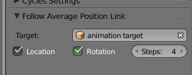

= Blender addon: copy average of location and rotation for the last _n_ frames of another object

Adds a panel in the Objects property where you can select a target object from which to copy the last _n_ frames, averaged out.
The addon is very simple: the position and rotation is read from the target object's f-curves: so it needs to be animated -- constraint animations, etc. would need to be baked.

